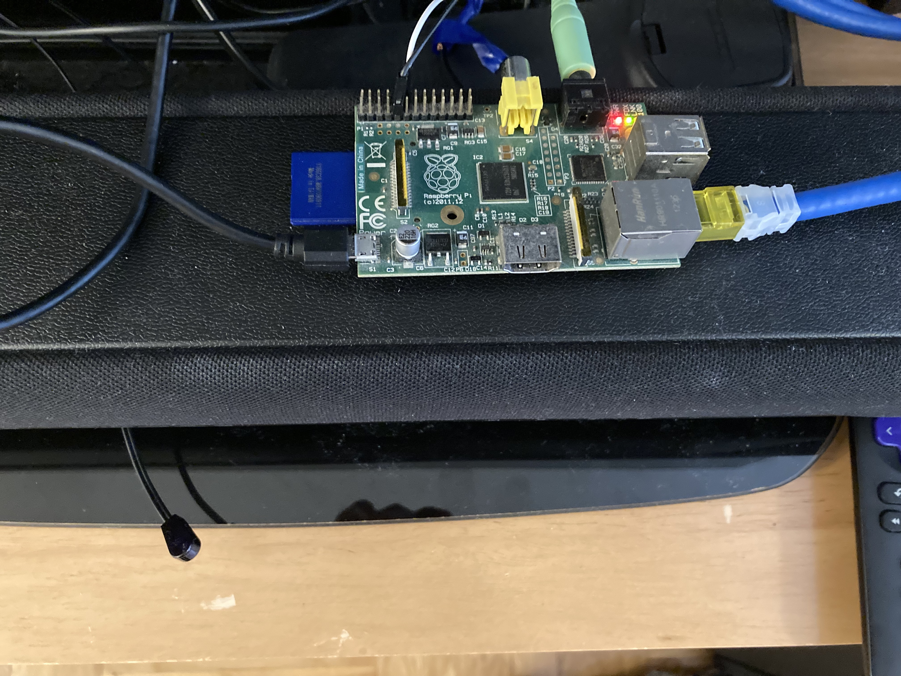

## YAS-207 Rasberry Pi Airplay

A slimmed down version of [wejn.org's airplay for the YAS-207 soundbar](https://wejn.org/2021/04/yas-207-bluetooth-protocol-reversed/) using just analog audio and IR commands.  I also used [Gordon Turner's Raspberry Pi IR Transmitter](https://blog.gordonturner.com/2020/06/10/raspberry-pi-ir-transmitter/) as a reference.

## Hardware setup



- Connect an audio cable from the Raspberry Pi's headphone jack to the input audio jack of the YAS-207
- Connect an [IR led](https://www.adafruit.com/product/387) (I actually clipped the emitter side off of an [IR repeater](https://www.amazon.com/Infrared-Extender-Repeater-Emitters-Receiver/dp/B07DS74691) I had lying about) to GPIO 18 and Ground.  On one of the legs, attach a 47-200 ohm resistor.  Use enough wire for the IR LED to reach the front of the YAS-207.


## Create an image

Create the raspberry pi OS Lite disk image.  Mount the SD card somewhere, and add an `ssh` file to the `boot` volume.  Also alter `config.txt` file in the `boot` volume to uncomment this line:

```
dtoverlay=gpio-ir-tx,gpio_pin=18
```


## Fix SSH interactivity

Add this line to the end of /etc/ssh/sshd_config [source](https://www.raspberrypi.org/forums/viewtopic.php?f=28&t=138631&p=1085534&hilit=qos#p1085534):

```
IPQoS 0x00
```

## Configure audio output
In my case, I chose headphone output, since I'm using the analog input.

```
sudo raspi-config
# choose System config
# choose audio
# choose output
```


## Infrared cmds

I combined the suffixes of the remote buttons on wejn.org's [remote reversing](https://wejn.org/2021/04/reversing-yas-207-infrared-remote/) page, with the stateless power on/off determined at the bottom of the [bluetooth reversing](https://wejn.org/2021/04/yas-207-bluetooth-protocol-reversed/) page in a later post.

`ir-ctl` is already installed on the system.

```
ir-ctl -S nec:0x78cc # power toggle
ir-ctl -S nec:0x787e # power on
ir-ctl -S nec:0x787f # power off
ir-ctl -S nec:0x78d1 # analog
```


## Install shairport-sync

[https://github.com/mikebrady/shairport-sync/blob/master/INSTALL.md](https://github.com/mikebrady/shairport-sync/blob/master/INSTALL.md)

Currently:

install deps:

```
sudo apt-get install build-essential git xmltoman autoconf automake libtool libpopt-dev libconfig-dev libasound2-dev avahi-daemon libavahi-client-dev libssl-dev libsoxr-dev
```

download/build/install shairport-sync:
 
```
$ git clone https://github.com/mikebrady/shairport-sync.git
$ cd shairport-sync
$ autoreconf -fi
$ ./configure --sysconfdir=/etc --with-alsa --with-soxr --with-avahi --with-ssl=openssl --with-systemd
$ make
$ sudo make install
```

## Configure shairport-sync

contents of `/etc/shairport-sync.conf`:

```
general =
{
  volume_range_db = 60;
};

alsa =
{
  // you may need to change this.  run shairport-sync -h and look
  // at the bottom for the list of output devices
  output_device = "hw:Headphones";
  mixer_control_name = "PCM";
};

sessioncontrol =
{
  run_this_before_play_begins = "/home/pi/shairport-start.sh";
};
```


Now make the start script, which needs to run some ir-ctl codes above shairport-sync user, which is what the service runs as, needs to be added to the `video` group to send codes via `ir-ctl`.

```
pi@raspberrypi:~ $ sudo usermod -a -G video shairport-sync
```


contents of `/home/pi/shairport-start.sh`:

```
#!/bin/sh

ir-ctl -S nec:0x787e # turn on, regardless of on/off
sleep 6  # approx how long it takes for the YAS-207 to "boot"
ir-ctl -S nec:0x78d1 # switch to analog input
```

make sure it is executable:

```
pi@raspberrypi:~ $ sudo chmod a+rx /home/pi/shairport-start.sh
```